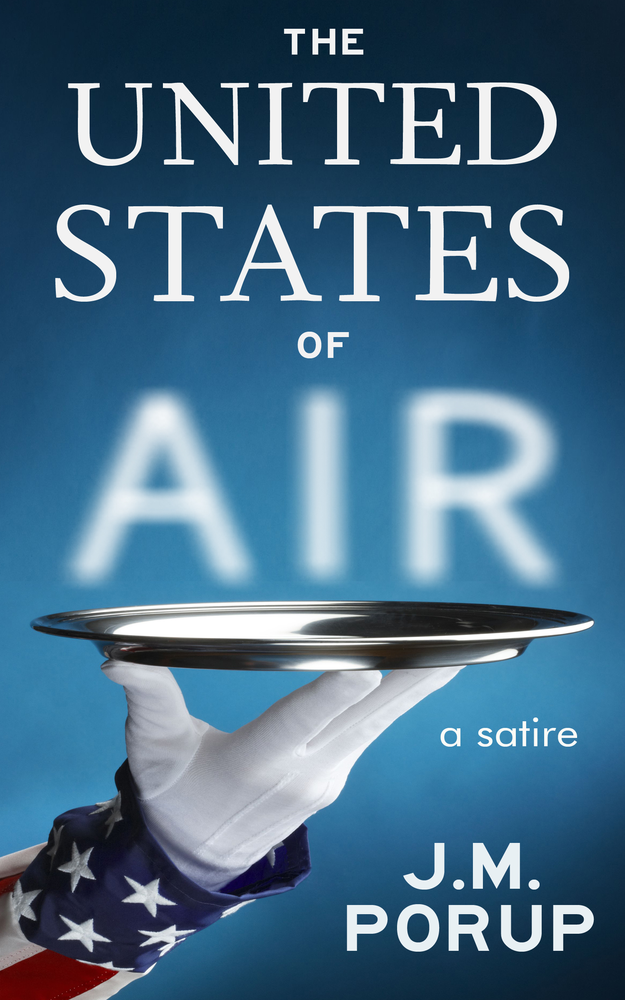

united-states-of-air
====================

Welcome to my series of GitHub novels.

See HOWTO for conversion instructions.

book details
============

**Title:** *The United States of Air*

**Genre:** Political Satire

**Word Count:** 80,000

**Book Description:**

**The National Sewer Agency is spying on people's toilets, looking for
food terrorists...**

Food Enforcement Agent Jason Frolick believes in America. He believes
in eating air. He struggles to get the food monkey off his back. As 
part of the Global War on Fat, his job is to put food terrorists in Fat
Camp.

When a pizza dealer gets whacked in the park across the street from the
Thin House, the Prophet Jones himself asks Frolick to investigate. For 
the first time ever, Frolick solves a murder—but what he finds out 
shakes his faith.

Will he ever be able to eat air again?
